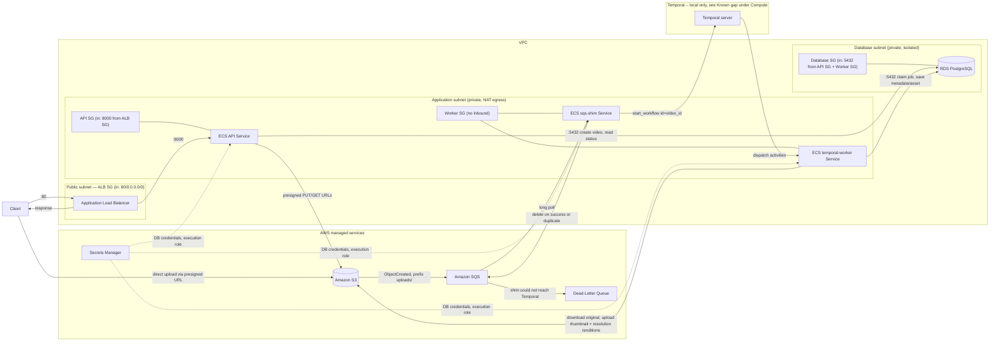

# Architecture

Detailed design reference for the platform: networking, security groups, compute, data stores, schemas, and system flows. See [`readme.md`](../readme.md) for the project overview, [`docs/SYSTEM-FLOWS.md`](SYSTEM-FLOWS.md) for how a video moves through the platform end to end, and [`docs/DEVELOPMENT.md`](DEVELOPMENT.md) for local setup.

## High-Level Diagram



Notes:

- One NAT Gateway (in the public subnet) gives the application subnet outbound-only internet access (for pulling images, calling AWS APIs); nothing initiates inbound connections from the internet to the application or database subnets.
- The database subnet is fully isolated (no NAT route) — RDS has no path to or from the internet.
- The API, `sqs-shim`, and `temporal-worker` each run as their own ECS Fargate service/task definition, so they can scale and fail independently (a core NFR of this project); they currently share `WorkerSG` since neither talks to anything the other doesn't.
- The `TemporalLocal` subgraph is the target shape drawn ahead of `infra/` -- see the Known gap under [Compute](#compute).

## Networking

| Layer | Type | Notes |
|---|---|---|
| VPC | 2 AZs | `max_azs=2` |
| Public subnet | `PUBLIC` | Hosts the ALB and the single NAT Gateway |
| Application subnet | `PRIVATE_WITH_EGRESS` | Hosts API and worker ECS tasks; outbound only, via NAT |
| Database subnet | `PRIVATE_ISOLATED` | Hosts RDS; no route in or out of the VPC |

One NAT Gateway (not one per AZ) is an intentional cost trade-off for a learning project — it's a single point of failure for outbound traffic, which would not be acceptable in a production environment.

## Security Groups

| Security group | Inbound | Outbound | Attached to |
|---|---|---|---|
| ALB SG | `0.0.0.0/0` : 80 | default (all) | Application Load Balancer |
| API SG | ALB SG : 8000 | all | API ECS tasks |
| Worker SG | none | all | Worker ECS tasks |
| Database SG | API SG : 5432, Worker SG : 5432 | none | RDS instance |

The API and worker security groups are separate so the database's inbound rules stay scoped to exactly the two things that need PostgreSQL access — nothing else in the VPC can reach it.

## Compute

- **ECS Cluster** — one Fargate cluster hosts all task definitions below; Container Insights enabled.
- **API Task Definition** (256 CPU / 512 MiB) — runs the FastAPI app on port 8000. Task role: `s3:PutObject` on `uploads/*` only (for presigned upload URLs). Execution role: read access to the RDS secret.
- **temporal-worker Task Definition** (1024 CPU / 2048 MiB) — runs `python -m video_processing.worker.temporal_worker`, which executes the workflow's activities (ffprobe, ffmpeg thumbnail, ffmpeg transcode), no ports. Sized above ffmpeg-thumbnail-only needs since transcoding multiple resolution renditions per upload is meaningfully more CPU-bound. Task role: `s3:GetObject` on `uploads/*`, `s3:PutObject` on `assets/*`.
- **sqs-shim Task Definition** — runs `python -m video_processing.worker.sqs_shim`: one database read and one `start_workflow` call per message, no ffmpeg, no ports. Task role: SQS consume permissions (receive/delete) on the processing queue.
- **Migration Task Definition** — one-off task running `alembic upgrade head` against RDS; run manually via `ecs run-task`, not part of a service.
- **Application Load Balancer** — public, listens on 80, forwards to the API service on 8000. Health check: `GET /health/ready` (verifies the API can reach the database, not just that the process is alive).

All task definitions share the same container image (from ECR) with different commands, keeping the build/deploy pipeline simple for this project's scope.

**Known gap:** the `temporal-worker`/`sqs-shim` split and the Temporal server itself exist only in the local Docker Compose stack (`docker-compose.yaml`), added by the Temporal migration. `infra/` has not been updated to match — the deployed Worker Task Definition still runs `python -m video_processing.worker.main`, a module that no longer exists in `src/`. The AWS stack is knowingly broken until a separate infrastructure follow-up adds a Temporal service (with its own database) and splits the worker task definition. Do not deploy between these two changes.

## Data Stores

- **Amazon S3** — one bucket, blocks all public access, S3-managed encryption, TLS enforced. `uploads/` holds originals (its `ObjectCreated` events are the only ones routed to SQS); `assets/` holds generated assets — thumbnails and transcoded resolution renditions — deliberately excluded from the notification filter so the worker's own writes don't retrigger itself.
- **Amazon RDS (PostgreSQL 16)** — `db.t4g.micro`, single-AZ, 20 GB allocated (autoscales to 50 GB), generated Secrets Manager credentials, private/isolated subnet. Default parameter group caps `max_connections` at ~112 for this instance size; the API's connection pool (20 max: `pool_size=10` + `max_overflow=10`) and the worker's (3 max, per-task capacity for videos processed concurrently within one poll cycle, not one job at a time) are both sized with that ceiling in mind, leaving headroom for horizontal scaling later without a config change. Locally, the worker pool is now split between `sqs-shim` (2 max, one short read per message) and `temporal-worker` (sized to `max_concurrent_activities`, up to 3 concurrent activity slots per video — see [`docs/DEVELOPMENT.md`](DEVELOPMENT.md)); the production split has not shipped yet (see the Known gap under [Compute](#compute)).
- **Amazon SQS** — one processing queue (15 min visibility timeout, 20s long polling) plus a dead-letter queue (`maxReceiveCount=3`). S3 publishes directly to it; no SNS fan-out, since there's currently only one consumer.
- **Amazon ECR** — one repository (`video-processing`), scan-on-push, keeps the last 10 images.
- **Secrets Manager** — RDS-generated credentials, injected into both the API and worker containers as individual secret fields (host/port/username/password/dbname), not a raw connection string.

## Data Model

### `videos`

| Column | Type | Notes |
|---|---|---|
| `id` | UUID (PK) | |
| `filename` | `varchar(255)` | Original filename as submitted by the client |
| `original_object_key` | `varchar(1024)`, unique | e.g. `uploads/{id}/original.mp4` |
| `status` | enum | `pending_upload` \| `processing` \| `completed` \| `failed` |
| `duration_ms` | integer, nullable | Set by the worker; integer milliseconds avoids float precision issues |
| `width` / `height` | integer, nullable | Set by the worker |
| `created_at` | timestamptz | |

### `processing_jobs`

| Column | Type | Notes |
|---|---|---|
| `id` | UUID (PK) | |
| `video_id` | UUID (FK → `videos.id`, cascade delete) | |
| `job_type` | enum | `metadata` \| `thumbnail` \| `transcode` — independent jobs per video, each claimed/retried on its own; kept as an enum so the pipeline can add job types later |
| `status` | enum | `pending` \| `processing` \| `completed` \| `failed` |
| `attempts` | integer | Incremented every time the worker claims the job |
| `started_at` / `completed_at` | timestamptz, nullable | |

`UNIQUE(video_id, job_type)` — prevents duplicate jobs for the same video/workflow; this is what makes `claim_job` safe to call more than once for the same video, whether that's a Temporal activity retry or a fresh workflow execution started by `POST /retry`.

### `generated_assets`

| Column | Type | Notes |
|---|---|---|
| `id` | UUID (PK) | |
| `video_id` | UUID (FK → `videos.id`, cascade delete) | |
| `asset_type` | enum | `thumbnail` \| `preview_1080p` \| `preview_720p` \| `preview_480p` |
| `object_key` | `varchar(1024)`, unique | e.g. `assets/{id}/thumbnail.jpg` or `assets/{id}/preview_720p.mp4` |
| `created_at` | timestamptz | |

`UNIQUE(video_id, asset_type)` — one asset per video per type (e.g. only one `preview_720p` rendition per video).

Enums are stored as their lowercase string values (not native PostgreSQL enum types), with a database check constraint — this keeps adding new enum values a simple migration rather than an `ALTER TYPE`.

## System Flows

See [`docs/SYSTEM-FLOWS.md`](SYSTEM-FLOWS.md) for the full flow-by-flow detail, including request/response bodies and the failure/retry/duplicate-delivery rules. Summary:

1. **Initialize an upload** — `POST /videos` presigns an S3 PUT URL and inserts a `pending_upload` row, committed only after the presign call succeeds. Video bytes never pass through the API or ALB.
2. **S3 publishes the upload event** — the `uploads/` prefix notification lands on the SQS processing queue; the object key embeds the video ID.
3. **Start and run the workflow** — `sqs-shim` reads the queue, validates the event against the `Video` row, and calls `start_workflow(VideoProcessingWorkflow, video_id, id=str(video_id))` on the self-hosted Temporal server. The workflow runs `extract_metadata_activity` and `generate_thumbnail_activity` concurrently, then `transcode_activity` once both have settled (transcode needs the source height). All three activities dispatch to `temporal-worker`, which owns the database session, S3 transfer, and ffmpeg/ffprobe subprocess for each. A permanent activity failure fails the workflow execution, but a sibling activity that already succeeded keeps its `completed` `ProcessingJob` row.
4. **Retrieve status** — `GET /videos/{id}` reads Postgres only; execution detail lives in the Temporal UI (`http://localhost:8080` locally), never the public API.
5. **Retry a failed video** — `POST /videos/{id}/retry` re-publishes the original upload event; `sqs-shim` starts a fresh workflow execution under the same workflow ID (`ALLOW_DUPLICATE_FAILED_ONLY` permits reuse only against a Failed, Cancelled, or TimedOut execution). No code path changed for this endpoint versus a fresh upload.

Supporting endpoints, unchanged:

```http
GET /health/live    # process is running — no dependency checks
GET /health/ready   # process can serve traffic — checks the database connection
```

The ALB health check uses `/health/ready`, so ECS won't route traffic to a task that's up but can't reach RDS.

## Status Model

The current enums have **no intermediate "queued" state** — an activity moves a video straight from `pending_upload` to `processing` when it claims the job (whether that's the first attempt or a retry):

```text
Video:        pending_upload → processing → completed | failed
ProcessingJob:            pending → processing → completed | failed
```

`failed` is not necessarily final: it means the workflow execution stopped and nothing is currently driving it. Once the activity retry policy (3 attempts, ~5s/~10s backoff) is exhausted, the workflow execution ends **Failed** — visible in the Temporal UI — and `POST /videos/{id}/retry` starts a fresh execution under the same workflow ID. This replaces the old SQS-redelivery/DLQ mechanism: processing failures now surface as Failed workflow executions rather than dead-letter-queue depth. The DLQ now means only "the shim could not reach Temporal", an infrastructure problem rather than a bad video.
