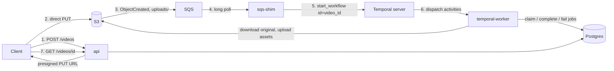

# System Flows

How a video moves through the platform, end to end, with Temporal orchestrating the processing stage. See [`docs/ARCHITECTURE.md`](ARCHITECTURE.md) for infrastructure and data-model detail, and [`docs/DEVELOPMENT.md`](DEVELOPMENT.md) for running any of this locally.

## The short version



Five things are worth holding onto before reading the detail:

- **Video bytes never pass through the API.** Uploads and downloads are presigned S3 URLs; the API only ever moves metadata.
- **The object key carries the video ID.** `uploads/{video_id}/original{ext}` is what lets an S3 event be correlated back to its `Video` row with no second API call.
- **The workflow ID is the video ID.** One video, one workflow execution. That is the entire deduplication mechanism, and it is what makes any video's execution history one lookup away in the Temporal UI.
- **Two systems own two different questions.** Postgres answers "what has this video produced, and is it done". Temporal answers "what is executing right now, and what happened on each attempt". Neither is a cache of the other.
- **Nothing is deleted until it is safe to delete.** The SQS message survives until the workflow has been accepted; each activity's database write happens only after its S3 upload succeeds.

## 1. Initialize an upload

```http
POST /videos
Content-Type: application/json

{ "filename": "demo.mp4", "content_type": "video/mp4" }
```

```text
Client -> API  validate filename (basename + extension, no path traversal)
               and content_type (must start "video/")
            -> video_id = uuid4(), object_key = uploads/{video_id}/original{ext}
            -> presign an S3 PUT URL (15 min)
            -> insert Video(status=pending_upload), commit
            <- { id, status, upload_url, expires_at }
```

**Ordering matters here.** The row is committed only *after* the presign call succeeds, so a broken S3 configuration never leaves behind a `Video` row whose upload can never happen. The same pattern appears in flow 5.

```text
Client -> S3   PUT the file directly, using the presigned URL
```

## 2. Upload event to workflow start

```text
S3 (uploads/ prefix only) -> ObjectCreated -> SQS

sqs-shim -> long-poll SQS (20s, batch up to 10, processed concurrently)
         -> parse the event; skip S3's one-off s3:TestEvent record
         -> recover video_id from the object key
              unparseable -> log, delete the message (it cannot become valid)
         -> load the Video row and verify its original_object_key matches
              no match -> log, delete the message (stale or unexpected event)
         -> start_workflow(VideoProcessingWorkflow, video_id, id=str(video_id))
              started                      -> delete the message
              WorkflowAlreadyStartedError  -> duplicate, delete the message
              anything else                -> leave the message for redelivery
```

The shim is deliberately thin: one queue read, one database read, one Temporal call. It runs no ffmpeg and moves no video bytes, so it can be sized small and restarted freely.

**Why the message is deleted on a duplicate.** `WorkflowAlreadyStartedError` means the work is already running or already finished. Re-delivering that message forever would be noise, not safety. Every *other* error leaves the message in the queue, so a Temporal outage delays processing rather than dropping it.

## 3. Process the video

The workflow schedules; the activities do the work. All I/O lives in activities.

```text
VideoProcessingWorkflow.run(video_id):

  metadata, thumbnail  (concurrently)
  |
  |-- extract_metadata_activity(video_id)
  |     claim the metadata job (already completed -> return the stored values)
  |     download the original from S3
  |     ffprobe -> duration_ms, width, height
  |     persist them, mark the job completed
  |     -> VideoMetadata
  |
  '-- generate_thumbnail_activity(video_id)
        claim the thumbnail job (already completed -> return immediately)
        download the original from S3
        ffmpeg, single frame at 00:00:01
        upload to assets/{video_id}/thumbnail.jpg
        record the asset, mark the job completed

  both must settle; if either failed, the workflow fails here

  transcode_activity(video_id, source_height=metadata.height)
        claim the transcode job (already completed -> return immediately)
        download the original from S3
        pick renditions strictly below the source height
          (1080p/5000k, 720p/2500k, 480p/1000k)
        ffmpeg scale + libx264 per rendition
        upload each to assets/{video_id}/preview_{h}p.mp4
        record the assets, mark the job completed

  once every job type has a completed row, the video is marked completed
```

**Why metadata and thumbnail run together.** Thumbnailing needs only the downloaded file. Transcoding is the only step that depends on another step's output, because it needs the source height to decide which renditions to produce.

**Why each activity downloads its own copy.** Activities may execute in different worker processes, so there is no safe shared temporary file. This costs up to three S3 GETs per video instead of one, traded for not having to coordinate storage between activities.

**Why a completed job short-circuits.** Every activity claims its job first, and a claim against an already-completed job returns nothing to do. That is what makes a partial re-run cheap: re-running the workflow after a transcode failure re-runs only the transcode. `extract_metadata_activity` is the one exception that still has to return something, since transcode needs the height, so it reads the stored values off the `Video` row rather than re-probing.

## 4. Retrieve status

```http
GET /videos/{video_id}
```

```text
API -> load the Video row (404 if missing)
    -> include metadata only once duration_ms, width, and height are all set
    -> presign a 15-minute GET URL for each generated asset
    <- { id, filename, status, metadata, assets }
```

Clients poll this while `status` is `pending_upload` or `processing`. The endpoint reads Postgres only; it never queries Temporal. Execution detail lives in the Temporal UI, and deliberately does not leak into the public API.

## 5. Retry a failed video

```http
POST /videos/{video_id}/retry
```

```text
API -> load the Video row (404 if missing, 409 if status is not "failed")
    -> re-publish the original upload's ObjectCreated event to SQS
    -> set status = processing, commit
    <- { id, status }
```

This duplicates no orchestration logic. It puts a synthetic event back on the queue and lets flow 2 run again exactly as it would for a real upload. The API never talks to Temporal, and needs no knowledge of workflow state, because the shim's start policy already distinguishes "retry a failed video" from "a duplicate of a healthy one".

As in flow 1, the status change is committed only after the queue write succeeds, so a broken queue cannot leave a video silently stuck in `processing` with nothing driving it.

## Failure, retry, and duplicate delivery

These three cut across the flows above and are easier to read together.

### What happens when an activity fails

An activity marks **only its own job** failed and re-raises. Temporal retries it on a bounded policy (3 attempts: ~5s, then ~10s). When the budget is exhausted, the error surfaces in the workflow and the execution ends as **Failed**.

Unrecoverable conditions skip the budget entirely. "No `Video` row for this ID" and "no known source height" cannot become true by waiting, so they are raised as non-retryable and fail immediately.

Two consequences:

- **A sibling's failure no longer condemns a job that succeeded.** Metadata and thumbnail both settle before the workflow fails, so a thumbnail that finished keeps its `completed` row. `video.status` still flips to `failed`, so the video-level view is unchanged; the per-job view is now accurate.
- **A job that never ran leaves no row at all**, rather than a `failed` row it never earned. Nothing API-visible depends on this, since the read model exposes assets and video status, not job rows.

### What "failed" means

```text
Video:         pending_upload -> processing -> completed | failed
ProcessingJob: pending -> processing -> completed | failed
```

`failed` is not terminal. It means "this stopped, and nothing is currently driving it". A `POST /retry` starts a fresh workflow execution under the same workflow ID and re-runs only the incomplete jobs.

Operationally, processing failures surface as **Failed workflow executions in the Temporal UI**, not as dead-letter-queue depth. The DLQ now means only "the shim could not reach Temporal", which is an infrastructure problem rather than a bad video.

### How duplicates are rejected

S3 delivers at least once, and a retry re-publishes deliberately, so a start attempt for an already-known video is normal traffic rather than an error.

| Situation | Outcome | Why |
|---|---|---|
| New upload | Workflow starts | No execution exists for that ID |
| Duplicate while processing | Rejected, message acknowledged | An execution is already open for that ID |
| Duplicate after success | Rejected, no reprocessing | The execution completed; reuse is not allowed |
| Retry, or redelivery after permanent failure | Fresh execution starts | Reuse is allowed only against a Failed, Cancelled, or TimedOut execution |

The last row is what makes `POST /retry` work without special-casing. The same start call covers all four situations, so no caller needs to know which one it is in.

## Who owns which state

| State | Owner | Read by |
|---|---|---|
| Video status, duration, dimensions | Postgres `videos` | `GET /videos/{id}` |
| Per-job status, attempt count, timings | Postgres `processing_jobs` | Operators, debugging |
| Generated asset keys | Postgres `generated_assets` | `GET /videos/{id}`, presigned downloads |
| Original and generated files | S3 | Activities, presigned client URLs |
| Pending upload notifications | SQS | `sqs-shim` |
| Which activities have run, retries, backoff, execution history | Temporal | Temporal UI, operators |

`ProcessingJob.attempts` is keyed on the video and job type, not on a Temporal run ID, so it keeps incrementing across a full workflow restart. It answers "how many times have we tried this job, ever", which is a different question from Temporal's per-execution attempt count.

## Supporting endpoints

```http
GET /health/live     # the process is running, no dependency checks
GET /health/ready    # the process can serve traffic, checks the database
```

`/health/ready` is what a load balancer should target, so traffic is not routed to a process that is up but cannot reach Postgres.
