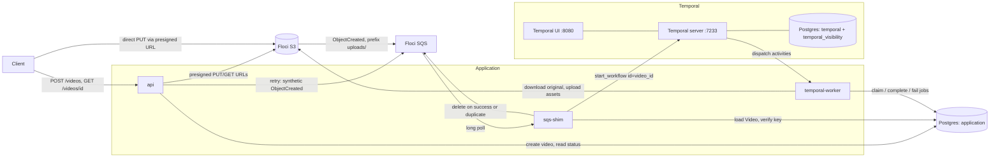

# Temporal Migration (local)

Migration spec for moving the worker's orchestration from a hand-rolled SQS poll loop to Temporal, **locally only**. See [`docs/ARCHITECTURE.md`](ARCHITECTURE.md) for the system as it stands today and [`docs/DEVELOPMENT.md`](DEVELOPMENT.md) for the current local setup.

**This document is temporary.** It exists to be executed. Once the local cutover lands, `docs/ARCHITECTURE.md` and `docs/DEVELOPMENT.md` absorb the as-built description (see [Task 6](#task-6-fold-into-the-permanent-docs)) and this file is deleted. Nothing should link to it from outside `docs/`.

AWS deployment is explicitly **out of scope**: no CDK changes, no ECS service, no RDS instance, no cost analysis. Those follow as a separate change once the local design is proven.

## Why

Two limitations are already recorded in the repository, both consequences of the current design rather than bugs:

- `docs/ARCHITECTURE.md:180` -- the three per-video jobs (`metadata`, `thumbnail`, `transcode`) are "independently retryable/observable, **not concurrently executed**". All three run serially inside one function call per S3 event (`worker/main.py:149-181`).
- `worker/main.py:177-181` -- one shared `except` wraps all three jobs, so `_fail_incomplete_jobs` marks `thumbnail` and `transcode` as `failed` when `metadata` throws, even though they never ran. The per-job read model lies about what actually happened.

Beyond fixing those, Temporal replaces three pieces of bespoke machinery with platform features: `claim_job`'s `IntegrityError` race handling becomes workflow-ID dedup, SQS visibility-timeout redelivery becomes activity retry, and `maxReceiveCount`/DLQ becomes a Failed workflow execution that is visible and re-drivable in a UI.

**What this migration does not do**: it does not move the documented API load ceiling (`docs/DEVELOPMENT.md:126`, ~80 concurrent users / ~550 req/s locally). That ceiling is the API's database connection pool, which this change does not touch. Same honesty bar as the async migration's note at `docs/DEVELOPMENT.md:156`.

## Scope and decisions

| Decision | Choice | Why |
|---|---|---|
| Breadth | Worker only | `api/`, the presigned upload flow, the S3 -> SQS notification, and `video_service.retry_video:99` are untouched. The blast radius is one process. |
| Temporal deployment | Self-hosted, four local services (`temporal-db`, `temporal`, `temporal-ui`, plus a one-off `temporal-admin-tools`) | Not Temporal Cloud, not `auto-setup`, not `temporal server start-dev`. Schema setup stays an explicit operator step, mirroring the project's existing "a bad migration must not block startup" convention (`docs/DEVELOPMENT.md:38`). |
| Database tables | `processing_jobs` and `generated_assets` kept as-is | They are the read model `GET /videos/{id}` serves. Temporal owns execution state (attempts, retries, timers); the tables keep owning the API-visible job/asset state. Two sources of truth for two different questions, not duplication. |
| Retry policy | `initial_interval=5s`, `backoff_coefficient=2.0`, `maximum_interval=1m`, `maximum_attempts=3` | Exact analog of the production queue's `maxReceiveCount=3` (`infra/infra/platform_stack.py:64`). |
| Cutover | Hard cutover with a drain step | The standard approach for a single-consumer queue. A setting-gated dual path would leave two code paths writing the same `processing_jobs` / `generated_assets` rows -- a real dual-write race, in a migration whose entire point is simpler failure semantics. |
| SQS | Kept | S3 bucket notifications need a delivery target, and the retry endpoint already publishes synthetic events to it. The queue stays; only its consumer changes. |

`temporalio>=1.33.0` is already in `pyproject.toml:15` and the project is pinned to Python 3.14 (`.python-version`, commit `dc0be54`). No Temporal code exists yet.

## Target architecture



Notes:

- The `worker` service is replaced by two: `sqs-shim` (queue consumer, no ffmpeg, tiny) and `temporal-worker` (runs the workflow and activities, owns the ffmpeg CPU budget). Splitting them means the thing that starts work and the thing that does work fail and scale independently.
- The application database and Temporal's database are separate Postgres instances. Temporal's schema is its own concern and its tooling (`temporal-sql-tool`) is not Alembic; sharing one instance would couple the app's migration story to Temporal's.
- The Temporal UI is the replacement for "tail the worker logs". Workflow ID is the video ID, so any video's full execution history is one URL away.

## System flows: current vs target

### 1. Initialize an upload -- UNCHANGED

```http
POST /videos
Content-Type: application/json

{ "filename": "demo.mp4", "content_type": "video/mp4" }
```

```text
Client -> API -> uuid4() + uploads/{id}/original{ext}
              -> presign S3 PUT (15 min)
              -> insert Video(status=pending_upload), commit only after presign succeeds
              <- { id, status, upload_url, expires_at }

Client -> S3 (direct PUT)
```

No change. `api/services/video_service.py:55-75`.

### 2. S3 publishes the upload event -- UNCHANGED

```text
S3 (uploads/ prefix only) -> ObjectCreated -> SQS processing queue
```

No change. `infra/infra/platform_stack.py:68-72` in production, `floci/init-sqs.sh` locally.

### 3. Start the workflow -- NEW (`worker/sqs_shim.py`)

This replaces the poll loop at `worker/main.py:210-231` and the per-message handling at `:189-207`. The receive/gather/delete-on-success shape is kept; the body of the work is replaced by one `start_workflow` call.

```text
sqs-shim -> long-poll SQS (20s, batch up to 10)
         -> parse_object_created_events()          [UNCHANGED, common/queue/s3_events.py:36]
         -> parse_video_id_from_key()              [UNCHANGED, common/queue/s3_events.py:60]
              None -> log, delete message (unrecognized key cannot become valid)
         -> load Video, verify object_key matches  [same guard as worker/main.py:130]
              no match -> log, delete message
         -> client.start_workflow(
                VideoProcessingWorkflow.run, video_id,
                id=str(video_id),
                task_queue=settings.temporal_task_queue,
                id_reuse_policy=ALLOW_DUPLICATE_FAILED_ONLY,
                id_conflict_policy=FAIL)
              -> started      -> delete message
              -> WorkflowAlreadyStartedError -> benign duplicate, delete message
              -> any other error (Temporal unreachable, etc.)
                                -> leave message undeleted for SQS redelivery
```

The shim does no ffmpeg, no S3 transfer, and one short database read. It is the only component that talks to both SQS and Temporal.

### 4. Process the video -- NEW (`worker/workflows.py` + `worker/activities.py`)

```text
Temporal server -> dispatch to temporal-worker on task queue "video-processing"

VideoProcessingWorkflow.run(video_id):

  -> gather(extract_metadata_activity(video_id),
            generate_thumbnail_activity(video_id),
            return_exceptions=True)          # both settle before either is raised

       [extract_metadata_activity]
         own DB session, own S3 download of the original
         claim_job(METADATA)
           returns None (already completed) -> build VideoMetadata from the stored
             Video row's duration_ms/width/height and return it without re-probing
         ffprobe                             [UNCHANGED, worker/processing.py:44]
         complete_metadata_job()             [UNCHANGED, worker/jobs.py:92]
         -> VideoMetadata(duration_ms, width, height)

       [generate_thumbnail_activity]
         own DB session, own S3 download of the original
         claim_job(THUMBNAIL); None -> return immediately
         ffmpeg single frame                 [UNCHANGED, worker/processing.py:64]
         upload assets/{video_id}/thumbnail.jpg
         complete_thumbnail_job()            [UNCHANGED, worker/jobs.py:109]

  -> if either returned an exception: raise it (the workflow MUST fail; see below)

  -> transcode_activity(video_id, source_height=metadata.height)
       own DB session, own S3 download of the original
       claim_job(TRANSCODE); None -> return immediately
       renditions_for_source_height()        [UNCHANGED, worker/transcode.py:36]
       ffmpeg per rendition                  [UNCHANGED, worker/transcode.py:40]
       upload each to assets/{video_id}/preview_{h}p.mp4
       complete_transcode_job()              [UNCHANGED, worker/jobs.py:128]

  -> workflow completes; the video row is already "completed" via
     _all_jobs_completed()                   [UNCHANGED, worker/jobs.py:66]
```

On a per-activity failure: the activity calls `fail_job` (`worker/jobs.py:149`, unchanged behavior) for **its own job only** and re-raises. Temporal retries it per the retry policy. Once retries are exhausted, `workflow.execute_activity` raises inside the workflow and the workflow execution ends as **Failed**.

### 5. Retrieve status -- UNCHANGED

```http
GET /videos/{video_id}
```

Returns `{ id, filename, status, metadata, assets }` exactly as before (`docs/ARCHITECTURE.md:218-231`). Clients still poll while `pending_upload` or `processing`.

### 6. Retry a failed video -- UNCHANGED CODE, new mechanism

```http
POST /videos/{video_id}/retry
```

`video_service.retry_video:99-124` needs **zero changes**. It still re-publishes a synthetic `ObjectCreated` message to SQS; the shim picks it up and calls `start_workflow` with the same uniform reuse policy, which allows a fresh execution precisely because the previous one is Failed. The endpoint never talks to Temporal.

## Workflow and activity contracts

`worker/activities.py` -- all I/O lives here:

```python
@activity.defn
async def extract_metadata_activity(video_id: uuid.UUID) -> VideoMetadata: ...

@activity.defn
async def generate_thumbnail_activity(video_id: uuid.UUID) -> None: ...

@activity.defn
async def transcode_activity(video_id: uuid.UUID, source_height: int) -> None: ...
```

`worker/workflows.py`:

```python
import asyncio
from datetime import timedelta

from temporalio import workflow
from temporalio.common import RetryPolicy

# This module is re-imported by the workflow sandbox on worker startup, so it
# must be import-safe: no module-level side effects, no asyncio.run(), no
# Settings() construction. Verified the hard way -- a module-level
# `asyncio.run()` here fails worker startup with
# "RuntimeError: Failed validating workflow VideoProcessingWorkflow".
with workflow.unsafe.imports_passed_through():
    from video_processing.worker.activities import (
        extract_metadata_activity,
        generate_thumbnail_activity,
        transcode_activity,
    )
    from video_processing.worker.processing import VideoMetadata

# Analog of the production queue's maxReceiveCount=3
# (infra/infra/platform_stack.py:64): three attempts, then permanent failure.
_RETRY_POLICY = RetryPolicy(
    initial_interval=timedelta(seconds=5),
    backoff_coefficient=2.0,
    maximum_interval=timedelta(minutes=1),
    maximum_attempts=3,
)


@workflow.defn
class VideoProcessingWorkflow:
    @workflow.run
    async def run(self, video_id: uuid.UUID) -> None:
        # return_exceptions so a thumbnail that succeeds still records its
        # completed row when metadata fails -- this is the concrete fix for
        # the limitation documented at docs/ARCHITECTURE.md:180.
        results = await asyncio.gather(
            workflow.execute_activity(
                extract_metadata_activity, video_id,
                start_to_close_timeout=timedelta(minutes=2),
                retry_policy=_RETRY_POLICY,
            ),
            workflow.execute_activity(
                generate_thumbnail_activity, video_id,
                start_to_close_timeout=timedelta(minutes=5),
                retry_policy=_RETRY_POLICY,
            ),
            return_exceptions=True,
        )
        for result in results:
            if isinstance(result, BaseException):
                # Must propagate: a workflow that swallowed this and completed
                # would make the video permanently un-retryable (see below).
                raise result

        metadata: VideoMetadata = results[0]
        await workflow.execute_activity(
            transcode_activity,
            args=[video_id, metadata.height],
            start_to_close_timeout=timedelta(minutes=30),
            retry_policy=_RETRY_POLICY,
        )
```

| Activity | `start_to_close_timeout` | Non-retryable failures |
|---|---|---|
| `extract_metadata_activity` | 2 min | no `Video` row for `video_id` |
| `generate_thumbnail_activity` | 5 min | no `Video` row for `video_id` |
| `transcode_activity` | 30 min | no `Video` row for `video_id`; no known source height |

Non-retryable cases are raised as `ApplicationError(..., non_retryable=True)`. A missing row or a missing height cannot become true by waiting, so retrying only burns the budget and delays the Failed state the operator needs to see.

`worker/sqs_shim.py`, the start call and its one exception path:

```python
from temporalio.client import Client
from temporalio.common import WorkflowIDConflictPolicy, WorkflowIDReusePolicy
from temporalio.exceptions import WorkflowAlreadyStartedError


async def _start_processing(client: Client, video_id: uuid.UUID) -> None:
    try:
        await client.start_workflow(
            VideoProcessingWorkflow.run,
            video_id,
            id=str(video_id),
            task_queue=settings.temporal_task_queue,
            # Closed executions: only a Failed/Cancelled/TimedOut one may be reused.
            id_reuse_policy=WorkflowIDReusePolicy.ALLOW_DUPLICATE_FAILED_ONLY,
            # Open executions: reject rather than join, so both duplicate cases
            # raise the same error and need one handler.
            id_conflict_policy=WorkflowIDConflictPolicy.FAIL,
        )
    except WorkflowAlreadyStartedError:
        # Already running, or already completed successfully. Either way this
        # delivery is a duplicate and the message should be acknowledged.
        logger.info("Workflow already exists for video %s; treating as duplicate", video_id)
```

Any other exception must propagate so the caller leaves the SQS message undeleted.

## Correctness requirements

These are the details that make or break the migration. Each one has a failure mode that would not show up in a happy-path test.

**1. The workflow must fail when an activity permanently fails.** If the workflow caught the error and returned normally, its execution would close as *Completed*. `ALLOW_DUPLICATE_FAILED_ONLY` rejects reuse against a Completed execution, so `POST /videos/{id}/retry` would then republish to SQS, the shim would get `WorkflowAlreadyStartedError`, treat it as a benign duplicate, delete the message -- and the video would be permanently un-retryable with no error anywhere. Non-negotiable.

**2. `extract_metadata_activity` must return `VideoMetadata` even when its job is already completed.** `claim_job` returns `None` for a completed job (`worker/jobs.py:52`). The workflow's transcode step depends on `metadata.height`, so on a partial retry the activity has to build `VideoMetadata` from the `Video` row's stored `duration_ms`/`width`/`height` rather than returning nothing. This is the Temporal-shaped equivalent of today's fallback at `worker/main.py:89`.

**3. Job rows are now created lazily, per activity.** Today `worker/main.py:142-144` claims all three up front, so an early failure leaves three rows. Under Temporal, an activity that never ran leaves **no** `processing_jobs` row at all. This does not affect anything API-visible: `GET /videos/{id}` never exposes job rows, and `_all_jobs_completed` (`worker/jobs.py:66-73`) counts completed rows against `len(JobType)`, which is unaffected by a missing row. Worth knowing when reading the table directly during debugging.

**4. Each activity marks only its own job failed.** `fail_job` is called per Temporal attempt, so `attempts` keeps incrementing 1 -> 2 -> 3 exactly as `docs/DEVELOPMENT.md:134` documents, now across activity attempts instead of SQS redeliveries. `video.status` still flips to `failed` when any one job fails, so the video-level read model is byte-identical to today's. What changes is that the *per-job* read model stops lying.

**5. `claim_job`'s `IntegrityError` branch (`worker/jobs.py:44-50`) becomes unreachable.** Workflow-ID dedup means no two concurrent attempts of the same activity for the same video. Leave the branch in place -- deleting it means proving unreachability in the same change that introduces the mechanism, which is the wrong time to be certain.

**6. `worker/main.py` has zero test coverage today.** `tests/worker/test_sqs_shim.py` is therefore net-new coverage of behavior that has only ever been verified by the manual end-to-end run (`docs/DEVELOPMENT.md:54-111`), not a port of existing tests. The real inherited safety net is `tests/worker/test_jobs.py` (193 lines), which covers the `jobs.py` functions the activities reuse unchanged.

**7. `docs/ARCHITECTURE.md:98` is already wrong before this migration begins.** It describes the worker pool as "strictly serial, one job at a time"; commit `f0e6fe5` made processing concurrent *across* videos. Task 6 fixes that line, but it is pre-existing staleness, not something this migration introduced.

## Dedup and retry semantics

Workflow ID is `str(video_id)`. Two policies are set explicitly on every `start_workflow` call, because they govern two different situations and only the pair covers all four cases:

- `id_reuse_policy=WorkflowIDReusePolicy.ALLOW_DUPLICATE_FAILED_ONLY` -- governs reuse against a **closed** execution.
- `id_conflict_policy=WorkflowIDConflictPolicy.FAIL` -- governs a start against an **open** execution.

`FAIL` is what `UNSPECIFIED` already maps to server-side, but set it explicitly. Relying on a server-side default mapping for the correctness of the whole dedup story is the kind of implicit dependency that breaks quietly on an upgrade.

| Case | Required behavior | Which policy delivers it |
|---|---|---|
| Genuine new upload | Start | Neither applies -- no prior execution with that ID |
| Duplicate S3 delivery while still running | No-op | Conflict policy `FAIL` -> `WorkflowAlreadyStartedError`, shim treats as benign |
| Duplicate delivery after success | No-op, do not reprocess | Reuse policy rejects reuse against a Completed execution |
| `POST /retry`, or SQS redelivery after permanent failure | Start a fresh execution | Reuse policy allows reuse against Failed / Cancelled / TimedOut |

**Why not `id_conflict_policy=USE_EXISTING`**, which would return a handle instead of raising? It only removes the exception for the *running* duplicate. The *completed* duplicate is governed by the reuse policy and still raises `WorkflowAlreadyStartedError`, so the handler is needed either way. `FAIL` gives both duplicate cases one identical control flow and one `except` clause; `USE_EXISTING` would give the same logical condition two different shapes.

Two consequences worth stating plainly:

- **`retry_video` needs no code changes at all.** Applying the same policy pair on every start is what buys that -- the shim never special-cases a retry.
- **Where state lives, after the migration.** Temporal owns attempt counts, backoff timers, and execution history *for the current execution*. `ProcessingJob.attempts` is not scoped to a Temporal run ID, so it survives a full workflow restart -- `claim_job` finds the pre-existing row and keeps incrementing. The DB answers "what has this video produced and is it done", Temporal answers "what is executing right now and what happened on each attempt".

The status model is unchanged, but the meaning of "not final" shifts:

```text
Video:         pending_upload -> processing -> completed | failed
ProcessingJob: pending -> processing -> completed | failed
```

`failed` was previously non-final until SQS exhausted `maxReceiveCount` and the message hit the DLQ. Now it is non-final until someone re-drives it: the Failed workflow execution is visible in the Temporal UI, and `POST /retry` starts a fresh one. **Operationally this is the biggest shift in the change**: processing failures stop showing up as DLQ depth and start showing up as Failed workflow executions. Anything that watched DLQ depth as a proxy for "processing is broken" now only sees "the shim could not reach Temporal".

## Temporal best practices, as they apply here

Generic advice, stated in the form it takes in this codebase.

**Determinism.** Workflow code re-executes from history on every workflow task, so it must be deterministic. No I/O, no `datetime.now()`, no `random`, no `uuid.uuid4()`, no `asyncio.sleep` in `worker/workflows.py`; use `workflow.now()`, `workflow.random()`, `workflow.uuid4()`, `workflow.sleep()`. `asyncio.gather` **is** safe -- Temporal runs the workflow on its own deterministic event loop.

**The sandbox and `imports_passed_through`.** Workflow modules are loaded in a sandbox that re-imports their dependencies. `worker/activities.py` transitively pulls in SQLAlchemy, aioboto3, and `common/config/settings.py:73`'s import-time `Settings()` construction. Importing that inside the sandbox on every workflow run is both slow and pointless, since the workflow only needs the activity *names*. Hence the `with workflow.unsafe.imports_passed_through():` block in the sketch above. This is not an optional nicety in this codebase; it is the difference between a sandbox that works and one that re-runs settings validation per workflow task.

**All I/O in activities; workflows only orchestrate.** The split here is clean because `worker/processing.py` and `worker/transcode.py` are already pure "local file in, local file/data out" modules. Activities do the database session, the S3 transfer, and the subprocess; the workflow does nothing but schedule.

**Keep payloads small.** What crosses the boundary: a `uuid.UUID`, an `int` height, and a `VideoMetadata` dataclass. Never file bytes -- Temporal's default payload limit is around 2 MB and history is retained per execution. `temporalio.contrib.pydantic` is not needed.

The default payload converter round-trips both `uuid.UUID` and the `VideoMetadata` dataclass correctly on `temporalio 1.33.0` -- verified, not assumed:

```text
UUID:            UUID  True   UUID('0ee7d44e-...')
dataclass:       VideoMetadata  True
UUID no-hint:    str   '0ee7d44e-...'
```

**The type hint is load-bearing.** Decoding is driven by the target type, so a `uuid.UUID` decoded without a hint comes back as `str` (third line above). Every `@activity.defn` and `@workflow.run` signature must be fully annotated -- an unannotated parameter silently hands the activity a `str` where it expects a `UUID`, and `db.get(Video, "0ee7...")` fails somewhere far from the cause.

**Activities must be idempotent.** Temporal executes activities at least once. Already satisfied: `claim_job` resumes rather than duplicating, and `_upsert_asset` (`worker/jobs.py:76-89`) updates in place so the `UNIQUE(video_id, asset_type)` constraint cannot reject a retry.

**`Client.connect` does not validate the namespace.** It returns successfully and instantly against a namespace that does not exist; the failure appears on the first real RPC (`RPCError: Namespace default is not found.`). `Worker.run()`, by contrast, validates up front and raises `RuntimeError: Worker validation failed: ...` immediately. So `temporal-worker` fails loudly on a misconfigured namespace while `sqs-shim` fails per message -- keep the shim's "leave the message undeleted on any non-duplicate error" rule, which is what turns that fail-late behavior into a safe retry instead of message loss.

**Import the SDK names from the right modules.** On `temporalio 1.33.0`: `WorkflowAlreadyStartedError` and `ApplicationError` live in `temporalio.exceptions` (**not** `temporalio.client` -- importing it from there raises `ImportError`); `RetryPolicy`, `WorkflowIDReusePolicy`, and `WorkflowIDConflictPolicy` live in `temporalio.common`; `Client` in `temporalio.client`; `Worker` in `temporalio.worker`.

**Always set `start_to_close_timeout`.** Temporal requires it (or `schedule_to_close_timeout`), and it is the only crash-detection mechanism in this design, since v1 has no heartbeating. Do not set `schedule_to_start_timeout` -- it fires on a backed-up task queue, which is a capacity condition, not a failure.

**Retry policy explicit, non-retryable errors marked.** Both covered above. The default retry policy is unlimited attempts, which is not what this project wants.

**Workflow ID is a business ID.** `str(video_id)`. This is what makes the Temporal UI directly useful for debugging: paste a video ID, get its history.

**Graceful shutdown.** Pass `graceful_shutdown_timeout` to `Worker` and handle SIGTERM (`docker compose restart` and `docker compose down` both send it). On shutdown, in-flight async activities are cancelled, so `transcode`'s ffmpeg subprocess must be killed on `asyncio.CancelledError` rather than orphaned -- an orphaned encode holds CPU and its temp directory after the container is gone.

**Versioning.** `workflow.patched()` / `workflow.deprecate_patch()` exist for changing code under running executions. These workflows live minutes, so drain-and-restart is sufficient; not worth the complexity locally.

**Testing pyramid.** `temporalio.testing.ActivityEnvironment` for activity unit tests (no server, no workflow). `WorkflowEnvironment.start_time_skipping()` with stub activity implementations for workflow tests -- this is what makes the retry/backoff assertions run in milliseconds instead of minutes. The real local stack is only for the end-to-end run.

**Deliberate simplifications**, each to be marked with a `# ponytail:` comment naming its upgrade trigger:

- **No activity heartbeating.** Crash detection waits for `start_to_close_timeout` (up to 30 min for transcode) instead of a heartbeat timeout. Upgrade path: `activity.heartbeat()` around the per-rendition loop plus a `heartbeat_timeout`, if faster crash detection matters.
- **Each activity downloads its own copy of the original.** Today `worker/main.py:153` downloads once and shares it across all three serial jobs. Activities may execute in different processes, so there is no safe default file sharing -- this trades up to 3x the S3 GETs for correctness. Upgrade path: Temporal Sessions / sticky task-queue affinity, if egress becomes a measured cost.

## Local stack

Four new Temporal services plus the split of `worker` into two. The existing `api`, `db`, and `floci` services are unchanged.

### Temporal server and database

```yaml
  temporal-db:
    image: postgres:16
    environment:
      POSTGRES_DB: temporal
      POSTGRES_USER: temporal
      POSTGRES_PASSWORD: temporal
    healthcheck:
      test: ["CMD-SHELL", "pg_isready -U temporal -d temporal"]
      interval: 5s
      timeout: 5s
      retries: 5
    # Deliberately no published port: nothing outside the compose network needs
    # it, and the application db already owns localhost:5432.
    volumes:
      - temporal_postgres_data:/var/lib/postgresql/data

  temporal:
    image: temporalio/server:1.32.0
    environment:
      DB: postgres12
      DB_PORT: "5432"
      POSTGRES_SEEDS: temporal-db
      POSTGRES_USER: temporal
      POSTGRES_PWD: temporal
      DYNAMIC_CONFIG_FILE_PATH: config/dynamicconfig/development-sql.yaml
    ports:
      - "7233:7233"
    volumes:
      - ./temporal/dynamicconfig:/etc/temporal/config/dynamicconfig:ro
    # The server binds to its own container IP, not 127.0.0.1, so the probe must
    # target $(hostname). BusyBox nc has no -z, hence the redirect from /dev/null.
    # ponytail: TCP-open only, not gRPC SERVING -- the server image ships no
    # health probe, curl, or temporal CLI. Add a grpc_health_probe sidecar only if
    # the open-but-not-serving window actually causes a problem.
    healthcheck:
      test: ["CMD-SHELL", "nc -w 1 \"$$(hostname)\" 7233 </dev/null"]
      interval: 5s
      timeout: 5s
      retries: 12
    depends_on:
      temporal-db:
        condition: service_healthy

  temporal-ui:
    image: temporalio/ui:2.54.1
    environment:
      TEMPORAL_ADDRESS: temporal:7233
      TEMPORAL_CORS_ORIGINS: http://localhost:8080
    ports:
      - "8080:8080"
    depends_on:
      - temporal

  # One-off operator tooling. `profiles` keeps it out of `docker compose up`,
  # the same way migrations are an explicit step and never run on startup.
  temporal-admin-tools:
    image: temporalio/admin-tools:1.32.0
    profiles: ["setup"]
    environment:
      SQL_PLUGIN: postgres12
      SQL_HOST: temporal-db
      SQL_PORT: "5432"
      SQL_USER: temporal
      SQL_PASSWORD: temporal
      TEMPORAL_ADDRESS: temporal:7233
    depends_on:
      temporal-db:
        condition: service_healthy
```

Tags are pinned, and every name above was verified by actually running these images (see [Verification](#verification) for what was checked). Three details that are easy to get wrong:

- **`DYNAMIC_CONFIG_FILE_PATH` is relative to the server image's working directory**, which is `/etc/temporal`. So `config/dynamicconfig/development-sql.yaml` resolves to `/etc/temporal/config/dynamicconfig/development-sql.yaml` -- exactly where the volume mounts it. The image ships no `config/` directory at all; the mount creates it. An absolute path or a mount anywhere else fails startup with `unable to create dynamic config client: ... no such file or directory`, and the server exits 1.
- **Docker Desktop on macOS does not share `/tmp` by default.** A bind mount from `/tmp` silently presents an empty directory, which looks identical to a wrong path. Keep the dynamic config inside the repo (`./temporal/dynamicconfig`), which is under a shared path.
- **`temporalio/admin-tools:1.32.0` has no `bash`**, only `sh`. Multi-command invocations need `sh -c`, and `set -o pipefail` is not available there.
- **The server binds to its container IP, not `127.0.0.1`.** Its entrypoint derives `BIND_ON_IP` from `getent hosts $(hostname)`, so `netstat` inside the container shows `172.x.x.x:7233` and a loopback probe fails. A healthcheck must target `$(hostname)`. The server image also has no `curl` and no `grpc_health_probe`; BusyBox `nc` is the only probe available, and it has no `-z` flag, so the check reads `nc -w 1 "$(hostname)" 7233 </dev/null`.

When bumping any of these tags, re-run the two setup commands below against a throwaway Postgres before trusting them -- Temporal has moved these paths and flags between versions.

`temporal/dynamicconfig/development-sql.yaml` is a new file, following the `floci/init-*.sh` precedent of a per-service config directory at the repo root:

```yaml
limit.maxIDLength:
  - value: 255
    constraints: {}
system.forceSearchAttributesCacheRefreshOnRead:
  - value: true
    constraints: {}
```

### Application services

`worker` is replaced by:

```yaml
  sqs-shim:
    build: .
    command: ["python", "-m", "video_processing.worker.sqs_shim"]
    environment:
      DATABASE_URL: postgresql+psycopg://video_processing:video_processing@db:5432/video_processing
      PYTHONPATH: /app/src
      AWS_ACCESS_KEY_ID: test
      AWS_SECRET_ACCESS_KEY: test
      AWS_REGION: eu-north-1
      S3_BUCKET_NAME: video-processing-local
      SQS_QUEUE_URL: http://floci:4566/000000000000/video-processing-local
      SQS_ENDPOINT_URL: http://floci:4566
      TEMPORAL_ADDRESS: temporal:7233
      TEMPORAL_NAMESPACE: default
      TEMPORAL_TASK_QUEUE: video-processing
      # One short read per message before start_workflow -- no concurrency-gated
      # resource, so a small fixed pool is correct. Deliberately does NOT set
      # WORKER_CONCURRENCY: that setting now governs only the Temporal worker.
      DB_POOL_SIZE: "2"
      DB_MAX_OVERFLOW: "1"
    volumes:
      - ./src:/app/src
    # Covers the startup window where the port is open but the server is not yet
    # SERVING, and the first-run window before the namespace exists.
    restart: on-failure
    depends_on:
      db:
        condition: service_healthy
      floci:
        condition: service_healthy
      temporal:
        condition: service_healthy

  temporal-worker:
    build: .
    command: ["python", "-m", "video_processing.worker.temporal_worker"]
    environment:
      DATABASE_URL: postgresql+psycopg://video_processing:video_processing@db:5432/video_processing
      PYTHONPATH: /app/src
      AWS_ACCESS_KEY_ID: test
      AWS_SECRET_ACCESS_KEY: test
      AWS_REGION: eu-north-1
      S3_BUCKET_NAME: video-processing-local
      S3_ENDPOINT_URL: http://floci:4566
      TEMPORAL_ADDRESS: temporal:7233
      TEMPORAL_NAMESPACE: default
      TEMPORAL_TASK_QUEUE: video-processing
      # Now means Worker(max_concurrent_activities=...), not an SQS batch size.
      # DB_POOL_SIZE must cover it: every running activity holds one connection
      # for its full duration, or the worker deadlocks on its own pool.
      WORKER_CONCURRENCY: "4"
      DB_POOL_SIZE: "4"
      DB_MAX_OVERFLOW: "2"
    volumes:
      - ./src:/app/src
    restart: on-failure
    depends_on:
      db:
        condition: service_healthy
      floci:
        condition: service_healthy
      temporal:
        condition: service_healthy
```

Note `sqs-shim` still needs `AWS_REGION` and `S3_BUCKET_NAME` even though it never touches S3 -- both are required fields on `Settings` (`common/config/settings.py:24-25`).

### First-time setup, in order

Two explicit operator steps, both mirroring the existing `alembic upgrade head` pattern: the server fails loudly rather than silently migrating itself. **Order matters** -- the schema must exist before the server starts, and the namespace must exist before the application services connect:

```bash
# 1. schema (compose starts temporal-db via depends_on; see the command below)
# 2. docker compose up -d temporal
# 3. namespace (needs the server running)
# 4. docker compose up          <- only now bring up api / sqs-shim / temporal-worker
```

Running `docker compose up` before step 3 is recoverable but noisy, which is why both application services carry `restart: on-failure`. The two failures look like this, and they are worth recognizing rather than debugging:

- `temporal-worker` exits immediately: `RuntimeError: Worker validation failed: Namespace default was not found or otherwise could not be described`.
- `sqs-shim` starts fine -- `Client.connect` does **not** validate the namespace, it succeeds instantly -- and then fails per message with `RPCError: Namespace default is not found.`. Because that is not a `WorkflowAlreadyStartedError`, the shim leaves the SQS message undeleted, so nothing is lost; the messages are processed once the namespace exists.

**1. Create Temporal's schemas** (once, before the first `docker compose up`):

```bash
docker compose run --rm --entrypoint sh temporal-admin-tools -c '
  set -eu
  temporal-sql-tool --database temporal create-database
  SQL_DATABASE=temporal temporal-sql-tool setup-schema -v 0.0
  SQL_DATABASE=temporal temporal-sql-tool update-schema \
    -d /etc/temporal/schema/postgresql/v12/temporal/versioned
  temporal-sql-tool --database temporal_visibility create-database
  SQL_DATABASE=temporal_visibility temporal-sql-tool setup-schema -v 0.0
  SQL_DATABASE=temporal_visibility temporal-sql-tool update-schema \
    -d /etc/temporal/schema/postgresql/v12/visibility/versioned
'
```

Three things this command gets right that the obvious version gets wrong:

- **`--database` is a global flag, not a `create-database` flag.** It must precede the subcommand. `create-database`'s only own option is `--defaultdb`; the database it creates is whatever the global `--database` (or `SQL_DATABASE`) names.
- **The visibility schema is at `.../postgresql/v12/visibility/versioned`**, a sibling of `temporal/`, not `.../v12/temporal/visibility/versioned`. Confirmed against the image: `/etc/temporal/schema/postgresql/v12/` contains exactly `temporal/` and `visibility/`.
- **`--entrypoint sh`**, because the image has no `bash`.

The `SQL_*` environment variables on the service map onto the tool's global flags: `SQL_HOST` -> `--endpoint`, `SQL_PORT` -> `--port`, `SQL_USER` -> `--user`, `SQL_PASSWORD` -> `--password`, `SQL_DATABASE` -> `--database`, `SQL_PLUGIN` -> `--plugin`. Supported plugins are `mysql8`, `postgres12`, `postgres12_pgx`, and `sqlite`; `postgres12` is correct for Postgres 16.

**2. Create the `default` namespace** (once, after the server is up):

```bash
docker compose run --rm temporal-admin-tools \
  temporal operator namespace create -n default --address temporal:7233
```

This step is genuinely required, not defensive. Unlike `temporalio/auto-setup`, a freshly-schema'd `temporalio/server` starts with exactly one namespace, `temporal-system`; `operator namespace list` shows no `default`. Without this step, `Client.connect(..., namespace="default")` fails.

Pass the name with `-n`. The positional form still works but warns: `Passing the namespace as an argument is now deprecated; please switch to using -n instead`.

Check the server is actually serving before running it -- the compose healthcheck only proves the TCP port is open:

```bash
docker compose run --rm temporal-admin-tools \
  temporal operator cluster health --address temporal:7233   # prints SERVING
```

If the two-step friction proves annoying in daily use, the one-line alternative is a non-`profiles` service with `depends_on: {temporal-schema: {condition: service_completed_successfully}}` on `temporal`. That trades the explicit-operator-step convention for convenience -- a deliberate choice, not a default.

## Process sizing and the database pool

`settings.worker_concurrency` changes meaning: it was "how many SQS messages (videos) the worker processes concurrently" (`common/config/settings.py:30-34`); it becomes `Worker(max_concurrent_activities=...)`. Its docstring must be updated, not just its call site.

The sizing math is the same order of magnitude as today, but expressed per process instead of one value gating SQS batch size, ffmpeg concurrency, and pool size simultaneously:

- One video can now occupy up to **3** concurrent activity slots (metadata and thumbnail run together, then transcode) where it previously occupied 1 job slot. Do not read the concurrency number as a video count.
- `temporal-worker`'s `DB_POOL_SIZE` must be at least `WORKER_CONCURRENCY`, because each running activity opens its own session and holds it for the activity's full duration. Under-sizing it makes the worker wait on its own pool, which looks like a slow encode rather than a misconfiguration.
- `WORKER_CONCURRENCY` still needs to be raised alongside available CPU. ffmpeg is CPU-bound; more concurrent activities than cores adds context-switching, not throughput. Same caveat as `docs/DEVELOPMENT.md:158`.
- `sqs-shim` has no concurrency-gated resource. Fixed small pool, no `WORKER_CONCURRENCY`.

## Migration tasks

Sequential. Each task ends green (`uv run ruff check .` and `uv run pytest`) before the next begins. Task 0 is already done.

### Task 0: dependency and Python alignment -- COMPLETE

Commit `dc0be54`: `temporalio>=1.33.0` added, `requires-python >= 3.14`, `.python-version` pinned to `3.14`, ruff `target-version = "py314"`. 58/58 tests green.

### Task 1: Temporal settings and client seam

Purely additive -- nothing calls this seam until Task 4.

- `common/config/settings.py`: add `temporal_address: str` (required, matching the style of `aws_region` / `s3_bucket_name` -- a worker that silently defaults to `localhost` inside a container is a bad failure mode), `temporal_namespace: str = "default"`, `temporal_task_queue: str = "video-processing"`. Update `worker_concurrency`'s docstring per the sizing section above.
- `tests/conftest.py`: add `os.environ.setdefault("TEMPORAL_ADDRESS", "localhost:7233")` alongside the existing setdefaults at `:10-17`. Required because `Settings()` is constructed at import time (`common/config/settings.py:73`) and `temporal_address` has no default.
- New `common/temporal/__init__.py` (empty, matching sibling packages) and `common/temporal/client.py`:

  ```python
  async def get_temporal_client() -> Client:
      return await Client.connect(
          settings.temporal_address, namespace=settings.temporal_namespace
      )
  ```

  Follow the module-docstring convention of `common/storage/s3.py` and `common/queue/sqs.py`. Note in the docstring that unlike those seams this returns an awaited client rather than an async context manager, because `Client.connect` is itself a coroutine -- a real API difference, not an inconsistency. Must not construct a client at import time.
- `tests/conftest.py`: add a fake Temporal client mirroring the existing `_FakeAsyncClientContext` / `fake_async_client` pattern (`tests/conftest.py:61-80`), supporting only `start_workflow`. Keep it minimal.
- Signatures stay typed as `uuid.UUID`. The default converter round-trip is already verified on `temporalio 1.33.0` (see the payloads item under [best practices](#temporal-best-practices-as-they-apply-here)); no `str` fallback needed. Keep every activity and workflow parameter annotated -- the annotation is what drives decoding.

Exit check: `uv run pytest` green.

### Task 2: activities

- New `worker/activities.py` with the three `@activity.defn` functions per the contracts above. Each owns its own DB session (`SessionFactory`), its own S3 download, and calls the unchanged `processing.py` / `transcode.py` / `jobs.py` functions. `ApplicationError(..., non_retryable=True)` for the non-retryable cases. `# ponytail:` comments for the two deliberate simplifications.
- `extract_metadata_activity` must implement correctness requirement 2 (return stored metadata when `claim_job` returns `None`).
- `transcode_activity` must kill its ffmpeg subprocess on `asyncio.CancelledError`.
- New `tests/worker/test_activities.py` using `temporalio.testing.ActivityEnvironment`. Cover: happy path per activity; `claim_job` returning `None` (already-completed job) for each; metadata's stored-value fallback; the non-retryable error cases; per-activity `fail_job` on failure.

Exit check: no Temporal server needed to run these tests.

### Task 3: workflow

- New `worker/workflows.py` per the sketch above.
- New `tests/worker/test_workflows.py` using `WorkflowEnvironment.start_time_skipping()` with stub activity implementations. Cover: happy path ordering (transcode receives metadata's height); metadata fails and thumbnail succeeds -> thumbnail still completes **and** the workflow fails (correctness requirement 1 and 4, the single most important test in this migration); retry exhaustion at 3 attempts.

Exit check: the "workflow fails when an activity permanently fails" assertion exists and passes.

### Task 4: worker and shim entrypoints

- New `worker/temporal_worker.py`: `Worker(client, task_queue=..., workflows=[VideoProcessingWorkflow], activities=[...], max_concurrent_activities=settings.worker_concurrency, graceful_shutdown_timeout=...)`, SIGTERM handled.
- New `worker/sqs_shim.py`: adapted from `worker/main.py:210-231` (poll loop) and `:189-207` (per-message handling). Same receive / gather / delete-on-success shape; body becomes parse -> validate -> `start_workflow` -> catch `WorkflowAlreadyStartedError` as a benign no-op. Sets both `id_reuse_policy=WorkflowIDReusePolicy.ALLOW_DUPLICATE_FAILED_ONLY` and `id_conflict_policy=WorkflowIDConflictPolicy.FAIL` explicitly (both from `temporalio.common`), and catches `WorkflowAlreadyStartedError` from `temporalio.exceptions`.
- New `tests/worker/test_sqs_shim.py` (net-new coverage, see correctness requirement 6). Cover: unrecognized key -> message deleted, no `start_workflow`; key/video mismatch -> message deleted, no `start_workflow`; happy path -> `start_workflow` called with `id=str(video_id)` and the reuse policy, message deleted; `WorkflowAlreadyStartedError` -> message deleted, no raise; any other exception -> message **not** deleted.
- Nothing is wired yet. `worker/main.py` is still the live path.

Exit check: both entrypoints importable and tested; `docker compose up` behavior unchanged.

### Task 5: local cutover

1. Add the Temporal services and `temporal/dynamicconfig/development-sql.yaml` to `docker-compose.yaml`; run the two setup steps.
2. Drain: `docker compose stop worker` and wait for in-flight messages to finish (watch its logs for the last "Completed processing" line). Messages still on the queue are fine -- the shim will pick them up.
3. Replace the `worker` service with `sqs-shim` and `temporal-worker`.
4. Delete `worker/main.py`. **Grep for importers first** (`process_uploaded_object`, `process_message`, `worker.main`) -- `docker-compose.yaml` and `infra/infra/services_stack.py:170` both reference it by command string, and the CDK reference must be left alone in this local-only change, so note it as a known-broken production path until the AWS follow-up lands.
5. Re-verify both scenarios from `docs/DEVELOPMENT.md:134` against the real local Temporal server:
   - **Permanently-broken upload**: confirm `attempts` increments 1 -> 2 -> 3, then the workflow ends Failed (visible in the UI) and `POST /retry` starts a fresh execution.
   - **Worker killed mid-transcode**: `docker compose kill temporal-worker` during a transcode. `restart: on-failure` brings it back by itself (SIGKILL exits 137), so no manual restart is needed -- confirm only the incomplete activity re-runs, `metadata`/`thumbnail` keep their `completed` rows, and no duplicate assets are produced.

Exit check: full `docker compose up --build` end-to-end run passes (see Verification), both regression scenarios re-verified.

### Task 6: fold into the permanent docs

Rewrite the affected sections of the permanent docs to describe the system **as built**, then delete this file.

| File | Section | Change |
|---|---|---|
| `docs/ARCHITECTURE.md` | Diagram (`:7-55`) | `Queue -->\|long poll\| Worker` becomes `Queue --> sqs-shim`; add the `sqs-shim -> Temporal server` and `Temporal server -> temporal-worker` edges. Narrow `Queue -> DLQ` to "the shim could not reach Temporal" and state the operational shift: processing failures now surface as Failed workflow executions, not DLQ depth. |
| `docs/ARCHITECTURE.md` | Compute (`:85-93`) | Split the Worker Task Definition row into a `temporal-worker` row (keeps the 1024/2048 ffmpeg sizing) and a small `sqs-shim` row. |
| `docs/ARCHITECTURE.md` | Data Stores (`:98`) | Fix the pre-existing "strictly serial, one job at a time" staleness (see correctness requirement 7) and describe the split pools. |
| `docs/ARCHITECTURE.md` | System Flows section 3 (`:178-216`) | Replace with the shim -> `start_workflow` -> activity orchestration description. Explicitly reference `:180`'s "not concurrently executed" as the limitation this migration fixed. |
| `docs/ARCHITECTURE.md` | Status Model (`:257-266`) | Describe `ALLOW_DUPLICATE_FAILED_ONLY` restart semantics in place of SQS-redelivery language. Same guarantee, different mechanism. |
| `docs/DEVELOPMENT.md` | Start the stack (`:19-24`), commands (`:162-181`) | New compose services, the two explicit setup steps, the Temporal UI URL. |
| `docs/DEVELOPMENT.md` | End-to-end test (`:72-96`) | Step 3 references the new containers; add "inspect the workflow in the Temporal UI" as an optional step. |
| `docs/DEVELOPMENT.md` | Load testing (`:126`) | State explicitly that this migration does not move the ~80-concurrent / ~550 req/s ceiling, and why. Same honesty bar as `:156`. |
| `docs/DEVELOPMENT.md` | Retry/failure verification (`:134`) | Re-describe both scenarios in Temporal terms; keep them as required manual re-verification steps. |
| `docs/DEVELOPMENT.md` | Estimated scale (`:152`) | `WORKER_CONCURRENCY` is now `max_concurrent_activities`; note the up-to-3-slots-per-video change. |
| `AGENTS.md` | "Work in progress" section | Delete -- it exists only to point agents at this document. |
| `docs/temporal-migration.md` | whole file | Delete. |

Do **not** edit `AGENTS.md` or the permanent docs before Task 5 lands -- they should describe what runs, not what is planned.

### Task 7: cleanup

- Grep for leftover `worker.main` / `process_uploaded_object` references outside `infra/`.
- Confirm `tests/worker/test_jobs.py` needed no changes; if it did, record what and why.
- Full `uv run pytest` and `uv run ruff check .`; check doc cross-references resolve.

## Verification

### Already performed while writing this document

The design was exercised against a real Temporal server (`temporalio/server:1.32.0` + Postgres 16, `temporalio 1.33.0`, Python 3.14) before any project code was written, using throwaway containers and a standalone script. What this proved, and what it would have cost to discover during Task 5 instead:

| Claim | Result |
|---|---|
| metadata and thumbnail run concurrently, transcode after | `['metadata:start', 'thumbnail:start', 'metadata:end', 'thumbnail:end', 'transcode:start(h=1080)', 'transcode:end']` |
| `uuid.UUID` survives the workflow and activity boundary | activity received a real `uuid.UUID`, not a `str` |
| duplicate start against an Open execution | `WorkflowAlreadyStartedError` |
| duplicate start against a Completed execution | `WorkflowAlreadyStartedError` |
| non-retryable activity error fails the workflow | execution status `FAILED` |
| sibling activity still completes when its partner fails | thumbnail reached `thumbnail:end` while metadata failed |
| start after a Failed execution | new run ID under the same workflow ID, completes |
| `RetryPolicy(maximum_attempts=3)` on a retryable error | exactly 3 attempts, ~5s then ~10s apart, 15.1s total, ends `FAILED` |
| `Client.connect` against a missing namespace | succeeds in 0.0s, no error |
| first RPC against a missing namespace | `RPCError: Namespace default is not found.` |
| `Worker.run()` against a missing namespace | `RuntimeError: Worker validation failed: ...` immediately |
| `nc -w 1 "$(hostname)" 7233` inside the server container | exit 0 open / exit 1 closed; `127.0.0.1` always fails |
| freshly-schema'd server's namespaces | only `temporal-system`; no `default` |
| the Temporal half of the compose block, run as written | schema step OK, `temporal` reached `healthy` in 6s, `cluster health` -> `SERVING`, `namespace create -n default` -> registered |

Two mistakes this caught that a plausible-looking implementation would have shipped: the visibility schema directory is `.../v12/visibility/versioned`, not `.../v12/temporal/visibility/versioned`; and `WorkflowAlreadyStartedError` is exported from `temporalio.exceptions`, not `temporalio.client`.

It also caught the sandbox import rule the hard way. With `asyncio.run(main())` at module level in the same file as the `@workflow.defn`, worker startup fails outright:

```text
RuntimeError: Failed validating workflow VideoProcessingWorkflow
  ... RuntimeError: asyncio.run() cannot be called from a running event loop
```

The sandbox re-imports the workflow's module to validate it. In this project the split is already right -- `worker/workflows.py` holds only the workflow, `worker/temporal_worker.py` holds the `asyncio.run` -- but keep it that way.

### Per task and end-to-end

**Per task**: `uv run ruff check .` and `uv run pytest` green (the CI commands, `.github/workflows/pull-request.yml`). There is no typecheck step in this project; ruff is the only static gate.

**End-to-end, after Task 5** -- the same manual flow as `docs/DEVELOPMENT.md:54-111`, plus Temporal:

```bash
docker compose up --build
```

```bash
# 1. Create the upload record
curl -X POST http://localhost:8000/videos \
  -H 'Content-Type: application/json' \
  -d '{"filename":"salmon.mp4","content_type":"video/mp4"}'
```

```bash
# 2. Upload directly to S3 using the returned upload_url
curl -X PUT --upload-file ./salmon.mp4 -H 'Content-Type: video/mp4' 'PASTE_UPLOAD_URL_HERE'
```

```bash
# 3. Watch the shim start the workflow and the worker run the activities
docker compose logs -f sqs-shim temporal-worker
```

```bash
# 4. Inspect the execution -- workflow ID is the video ID
open http://localhost:8080
```

Expect metadata and thumbnail activities to run **concurrently** in the execution timeline, transcode after. That visible overlap is the headline behavior change.

```bash
# 5. Confirm the read model is unchanged
curl http://localhost:8000/videos/PASTE_VIDEO_ID
```

Expect `status: "completed"`, populated metadata, and the same assets as before: `thumbnail` plus one `preview_{height}p` per standard resolution strictly below the source height.

**Required regression re-verification** (both from `docs/DEVELOPMENT.md:134`, re-run against real local Temporal, not just in tests):

1. Permanently-broken upload -> `attempts` increments 1 -> 2 -> 3, workflow ends Failed, `POST /videos/{id}/retry` starts a fresh execution that appears in the UI under the same workflow ID.
2. `temporal-worker` killed mid-transcode -> only the incomplete activity re-runs on restart; `metadata` and `thumbnail` keep their `completed` rows; no duplicate assets.

**Duplicate-delivery check** (new, cheap, covers the dedup table's middle two rows): publish the same synthetic `ObjectCreated` message to the queue twice in quick succession and confirm exactly one workflow execution exists and the second message is deleted without error.

## Known gaps

- **No activity heartbeating.** Crash detection waits for `start_to_close_timeout`, up to 30 minutes for transcode. `# ponytail:`-marked; upgrade path is `activity.heartbeat()` plus a `heartbeat_timeout`.
- **Each activity re-downloads the original**, up to 3x the S3 GETs of today's single shared download. `# ponytail:`-marked; upgrade path is Temporal Sessions or sticky-queue affinity, if egress becomes a measured cost.
- **AWS is left inconsistent.** After Task 5, `infra/infra/services_stack.py:170` still runs `python -m video_processing.worker.main`, a module that no longer exists. The deployed stack is knowingly broken until the AWS follow-up (new Temporal service, its own database, split worker task definitions) lands. Do not deploy between these two changes.
- **`Dockerfile:17` installs via plain `pip install .`, not from `uv.lock`.** Pre-existing, but slightly more consequential now that a dependency ships a compiled Rust core: the container can resolve a different `temporalio` build than the lockfile pins. Only act on it if a version mismatch actually surfaces.
- **`worker/main.py` had no tests**, so the shim's behavior has no inherited regression net. Its test file is new coverage of previously-unverified behavior.
- **The Temporal image tags will drift.** `temporalio/server:1.32.0`, `temporalio/admin-tools:1.32.0`, and `temporalio/ui:2.54.1` were current and verified on 2026-09-16. Temporal has relocated schema directories, renamed environment variables, and deprecated CLI argument forms between versions, so a tag bump means re-running the two setup commands against a throwaway Postgres, not just editing a number.
